# Welcome to Tic-Tac-Toe in “Fruity-style"

This is an implementation of the well-known game Tic-Tac-Toe. With this two player-version of the game a set of users can have some enjoyable time while waiting for the bus or just want a friendly challenge. Use your strategic mind to win the game by placing your icons in a row on the board while blocking your opponent from doing the same. The game is accessible from this link 
[Fruity Tic-Tac-Toe](https://jnicolin.github.io/MS2-TicTacToe/)

# User value
Playing this game could invite the players to have a nice relaxing moment, to let players enjoy themselves in a break from work, on the bus or while waiting at the dentist.

Playing games is a fun way of training and maintaining logic thinking, as well as thinking strategically – even if on a less complex level.

# Implemented user stories
## As a player I want to,
- know how to play the game, so that I can get started 
- select my player-icon, so that the games feels personal
- adjust the visuals and characteristics of the game, to have a more personal feeling
- know the current score, so that I know how I am doing
- have feedback during the game to know how the game progresses from start to end

## Ideas for coming releases
The game could be developed further to create additional satisfaction. Here are a few potential user stories to select from
- Select to play agains a computer or a human
- Ask for the next best move
- User can resize the board with 3x3, 4x4 or 5x5 gameboard options

# Features
## Buttons to open show rules and settings information
| Buttons                                |
| ---------------------------------------|
| |

- A button to open a Select-dialogue for a fruit-icon 
- A button to open a Select-dialogue for selecting number of rounds in a game 

## Icons on the board are added after each user click
| After one click                               |Two clicks                     | Five clicks                               |
| ----------------------------------------------|-------------------------------|-------------------------------------------|
| 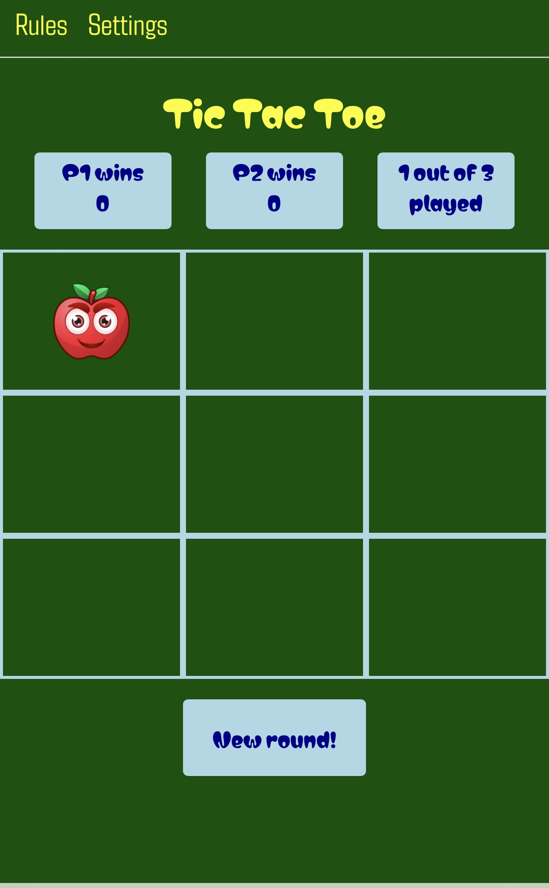 | 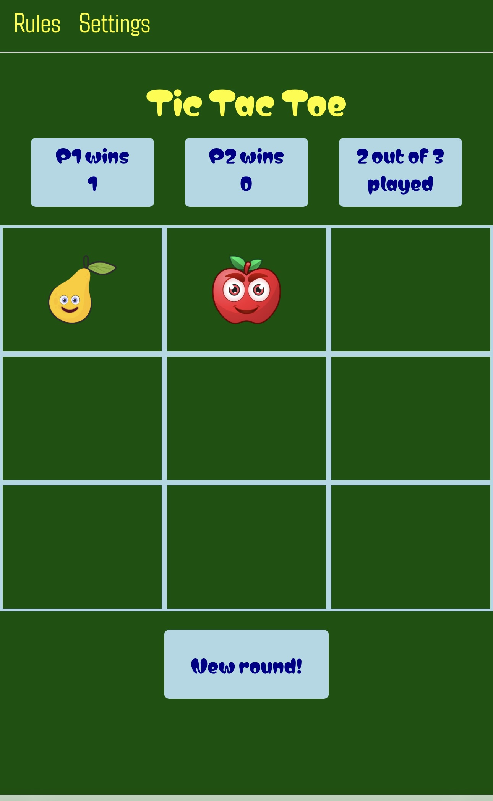 | 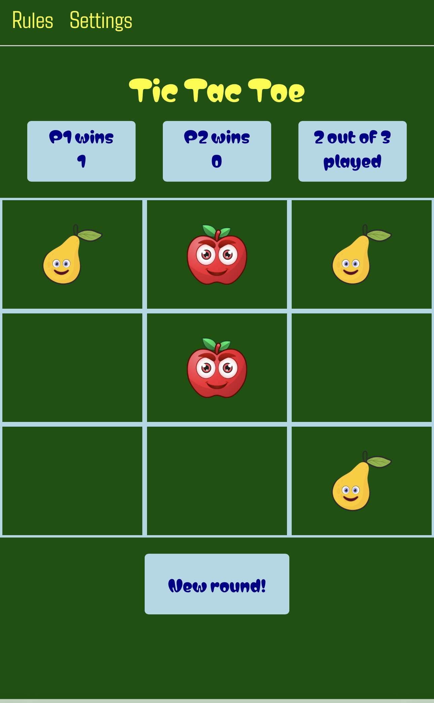

## Icons on the board are replaced after end of round
| Before end                                    |After end of round             | 
| ----------------------------------------------|-------------------------------|
| 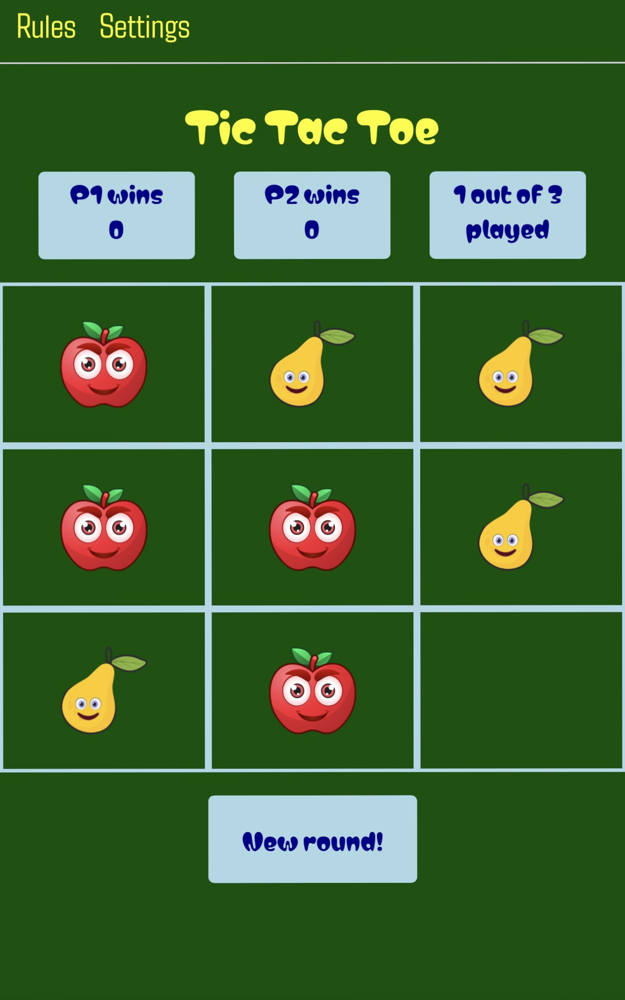  |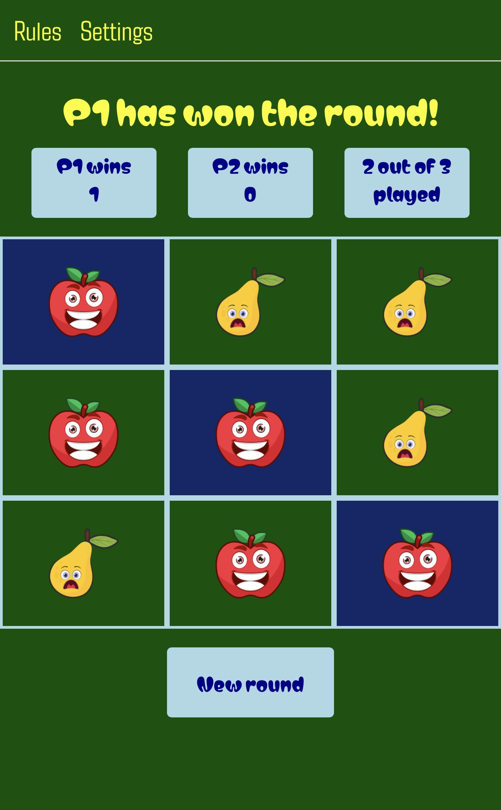  |

Icons are shifted at end of game to indicate winner/looser mood

## One single modal with dynamic content
| Welcome                                       |Rules                          | Settings                                  |
| ----------------------------------------------|-------------------------------|-------------------------------------------|
| 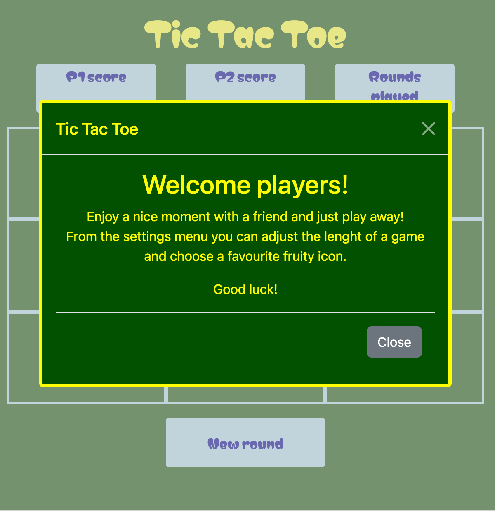  | 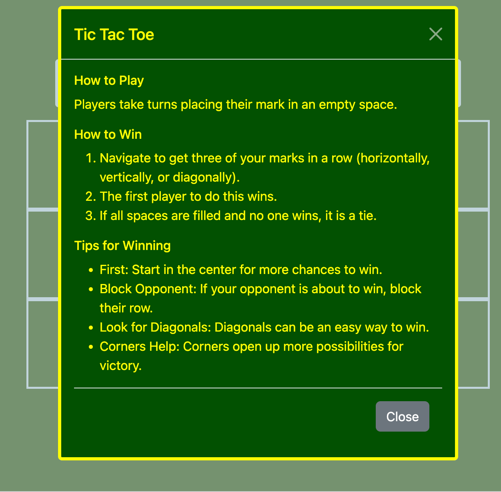  | 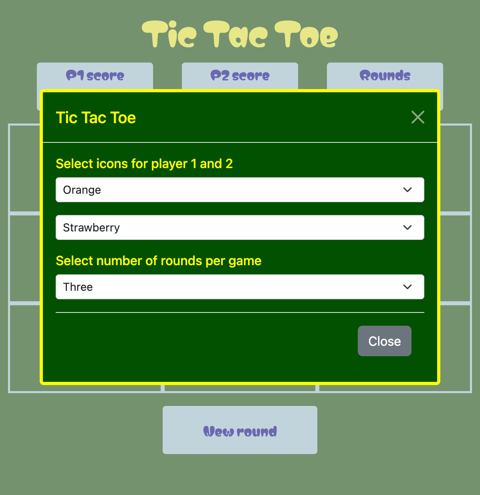 |

The single modal adjusts its content dependning on the event that triggered it to open. The welcome modal opens on the page loaded-event, the other two open when a user clicks on buttons

## Header text and score-dialogues with dynamic content
| Initial                                       | After end of round                          | after end of game                                  |
| ----------------------------------------------|-------------------------------|-------------------------------------------|
|  | 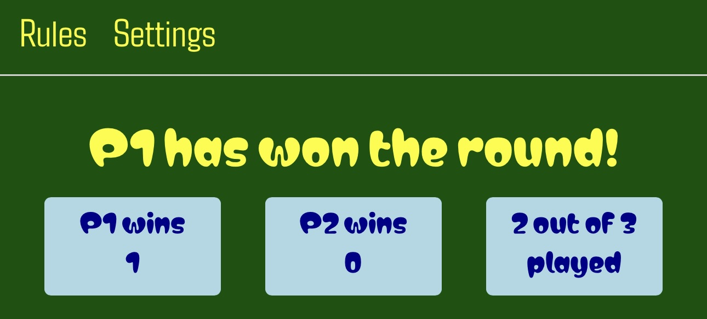 | 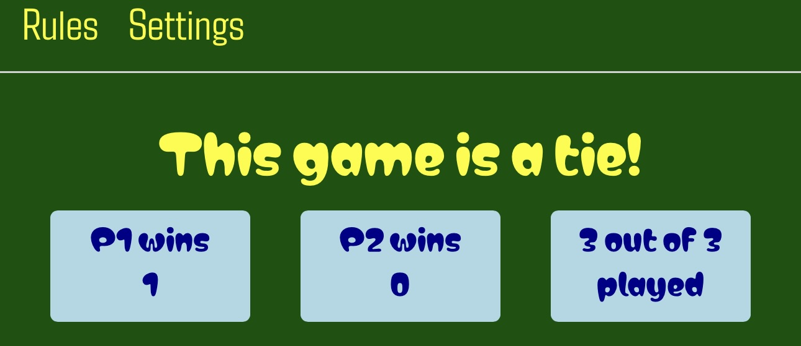|

- The header text and score-dialogues updates to show the curret state of the game, who won or if there is a tie 

## Reset button with dynamic content
| Next round                       | Next game           | 
| ----------------------------------------------|-------------------------------|
| 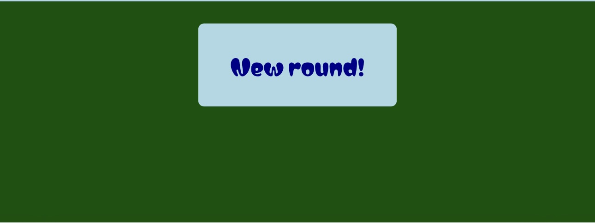  |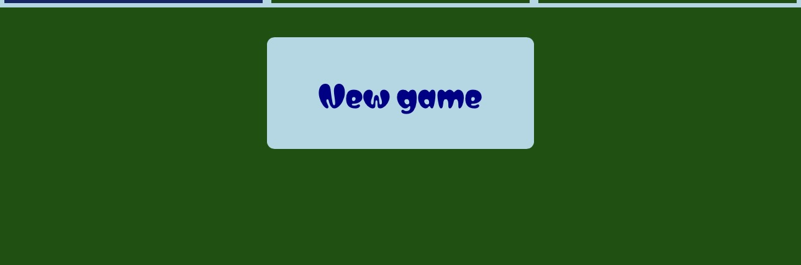  |
- The reset button text updates according to progress of the game - next round / next game

# Design 
## Wireframes for different viewports

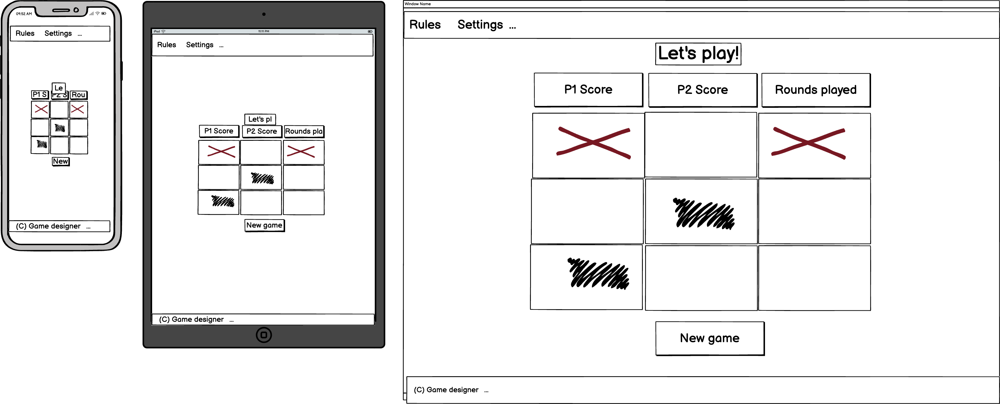   

## Color scheme
The choice of colors was done with the intention to give an energizing and happy feeling while playing. Strong colors and somewhat naive but yet colorful icons as a complement. 

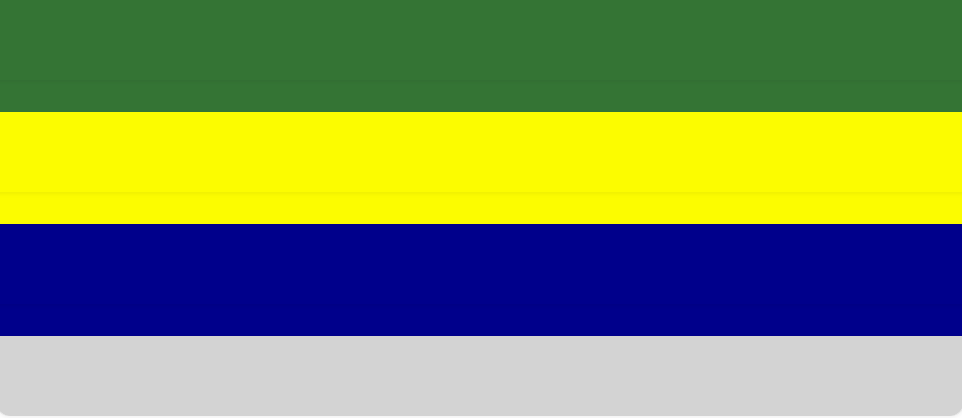

## Choice of fonts
The choice of the main font was done to reflect a relaxed and happy mood, which is part of the ambition for providing the game.

## Choice of icons
The choice of fruits in a cartoon style was done to emphasise playful intention of spending time with this game.

# Quality and test
## Manual testing
- Test of updates of texts in the score- and progresss disalogues, to reflect scores and state of the game 
- Test that the text of the restart button shifts to reflect if a click triggers a new game or a new round 
- Test of the rules button. Should open the modal with rules-content
- Test of the settings button. Should open the modal with options for the users to make selections
- Test of the app to caputure user input from the settings modal 
- Test that the welcome modal opens on when the game is loaded, with a content greeting the players to the game 
- Test of the logic to determine the impact of a click on the game board. Icons should be added correctly. Determine if there is a winner, if there is a tie. Determine if the round is over and if all the rounds in the game are over. 
- Test that all icons are flipped to show a happy/winner and sad/looser icon after the end of each round. 

### Tools based utomated validation
-	CSS-validator
-	HTML-validator
-	JS-Linter
-	Lighthouse - Performance, Accessibility
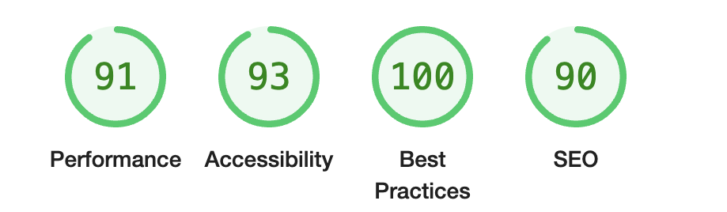

- There were two warnings related to accessibility and the Aria declarations, that I understand are related to the use of Bootstrap for the modal. 

- Responsiveness – Am I Responsive
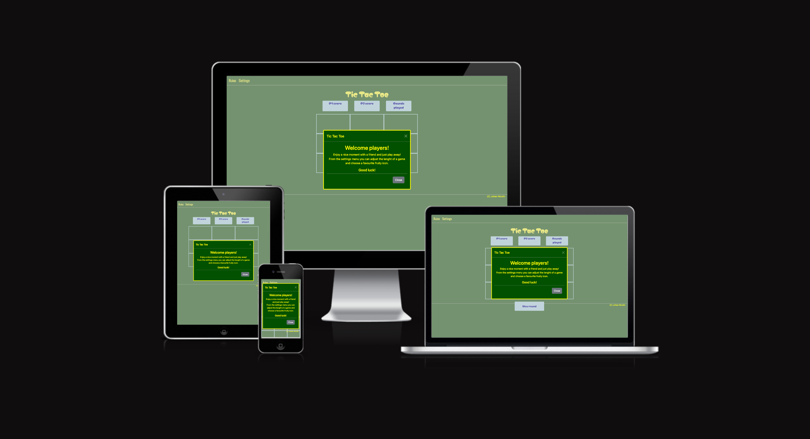

## Summary of test outcomes
### Major challenges, resolved
- Testing the logic to determine the outcome of every user click was a quite large task, as there are som many combinations to test.  
- Implementation of the logic related to the concept of “rounds” in the context of a “game”. This was quite tricky since it came with a lot of dependencies to updating the information to the user on the progress of the game. 
- Adapting the content of one single modal to the triggering event required some problem solving. 

### Known remaining bugs
- After all testing and validation, there are no known remaining bugs. 

# Technologies and frameworks used
- HTML5
- CSS3
- JavaScript
- Bootstrap 
- Node,js for test?
- GitHub and GitPod

# Deployment
The game was deployed to GitPage from GitHub. Follow this sequence to deploy the site after changes to the code:

1. Select the TicTacToe repository in GitHub
2. Click on "Settings" on the upper right hand side and select Pages
3. Under "Default Branch" - set the value to "main"
4. Save the settings. Deployment is now initated.
5. Press "Code" symbol to return to the main page
6. Look for "Deployments" on the right hand bar. 
7. The last deployment shall be indicated as ongoing or done.

The deployed site is available via this [Link](https://jnicolin.github.io/MS2-TicTacToe/)

# References and acknowledgements
- My mentor Antonio Rodriguez for very helpful and professional guidance during the project calls. 
- https://www.freepik.com/ – fruit icons designed by Rohim and Shuvo Das
- https://pixlr.com/remove-background - remove background from .png icons
- https://stackoverflow.com/questions/
- https://getbootstrap.com/
- https://validator.w3.org/
- https://www.w3schools.com/
- https://github.com/Swarnil/Tic-Tac-Toe-with-Html-CSS-Bootstrap-and-JavaScript/
